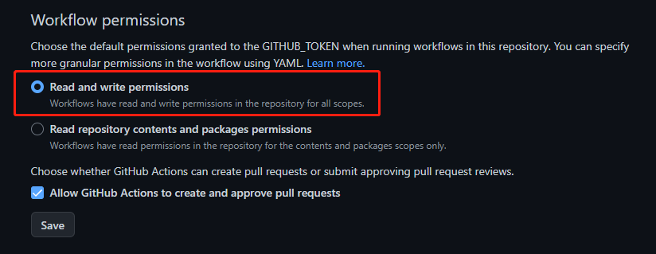
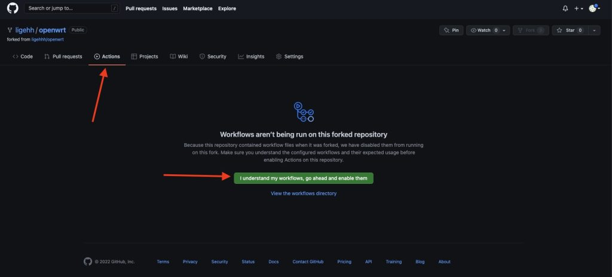

 

<h1 align="center">

GitHub Actions For N30PRO OpenWrt

</h1>

## 友情提醒 🤣
此仓库只是拉取源码进行编译，本人并不会修复相关问题！
 源码更新，我也会点一下action. 

## 食用教程 🛠

### 1、Fork本仓库 📌
右上角 `Fork`  `star`可以给予鼓励。

### 2、仓库读写权限 🤔

前往Fork之后的仓库页面，按下图实例图示点击，更改读写权限。 

### 3、开始编译 🚀

前往Fork之后的仓库页面，按下图实例图示点击，等待编译结果即可。

## 特别鸣谢 🥰

|          [lean](https://github.com/coolsnowwolf/lede)         |        [天灵](https://github.com/1715173329)               |              [lorz](https://github.com/1orz/My-action)               |              [P3TERX](https://github.com/P3TERX/Actions-OpenWrt)               |          [Zxilly](https://github.com/Zxilly/UA2F)         |              [stupidloud](https://github.com/stupidloud/cachewrtbuild)               |              [hanwckf](https://github.com/hanwckf/immortalwrt-mt798x)               |              [padavanonly](https://github.com/padavanonly/immortalwrtARM/tree/mt7981)               |
| :----------------------------------------------------------: | :----------------------------------------------------------: | :----------------------------------------------------------: | :----------------------------------------------------------: | :----------------------------------------------------------: | :----------------------------------------------------------: | :----------------------------------------------------------: | :----------------------------------------------------------: |
|  |  |  |  |  |  |  |  |

## Star History

 

 
 

